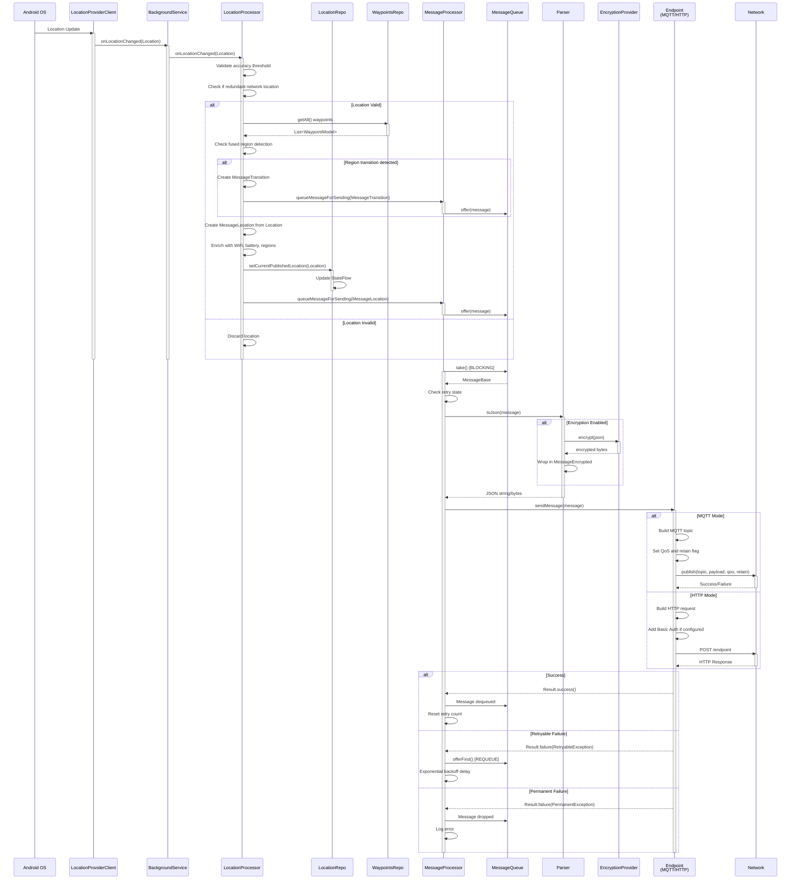
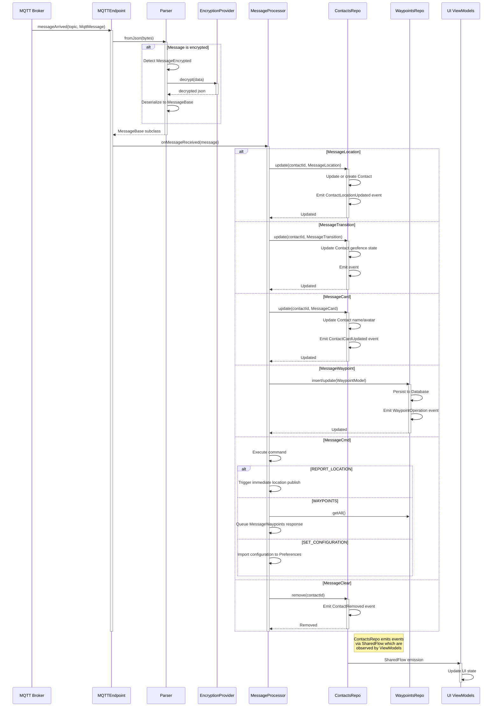
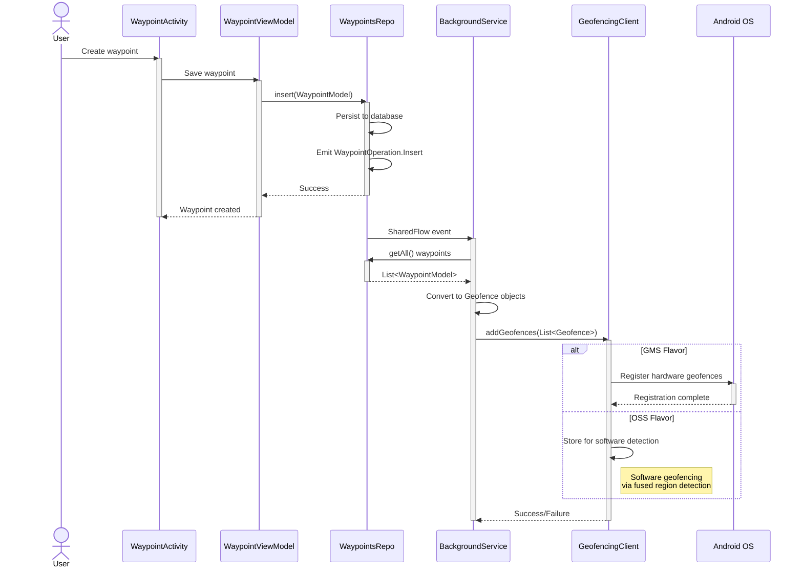
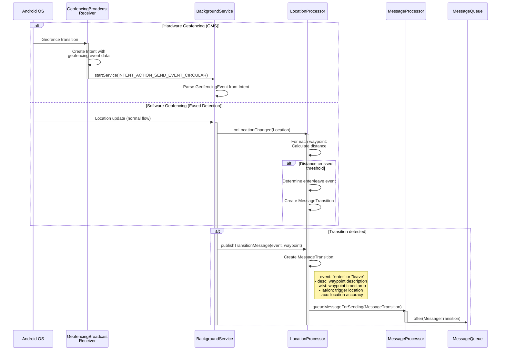
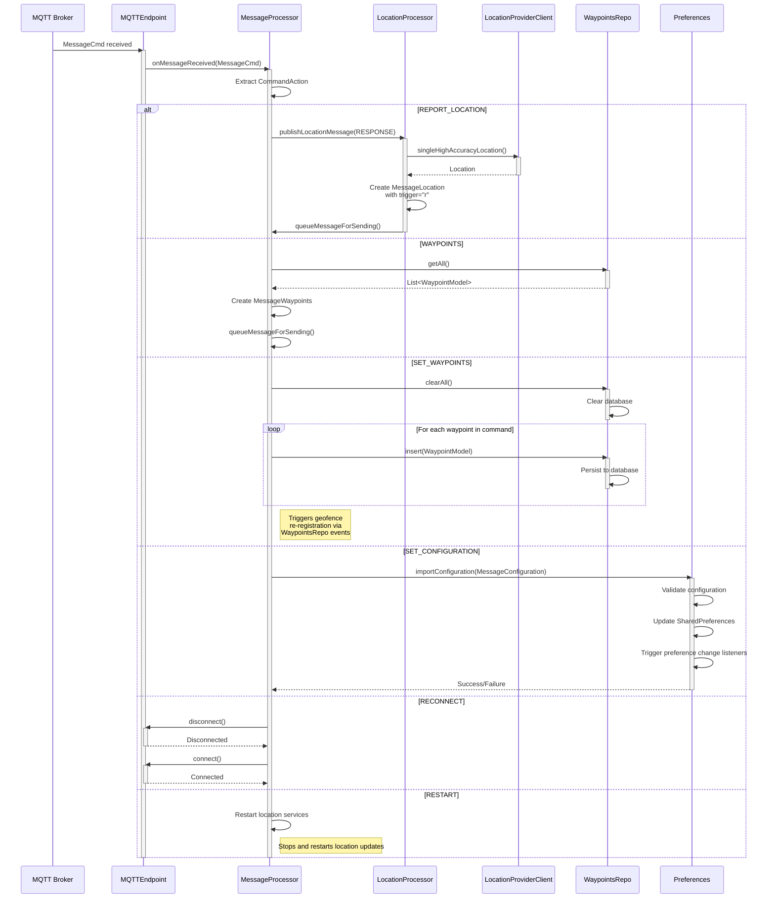
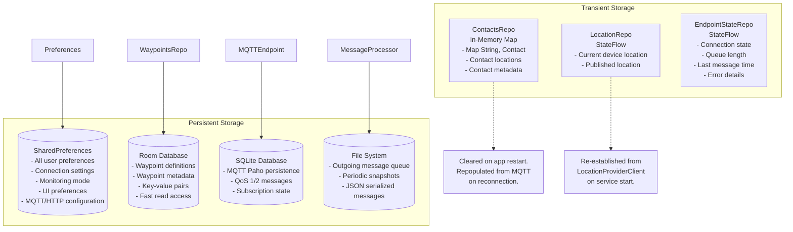
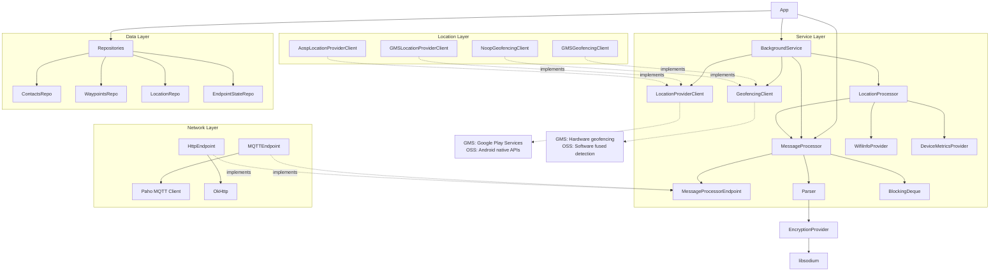
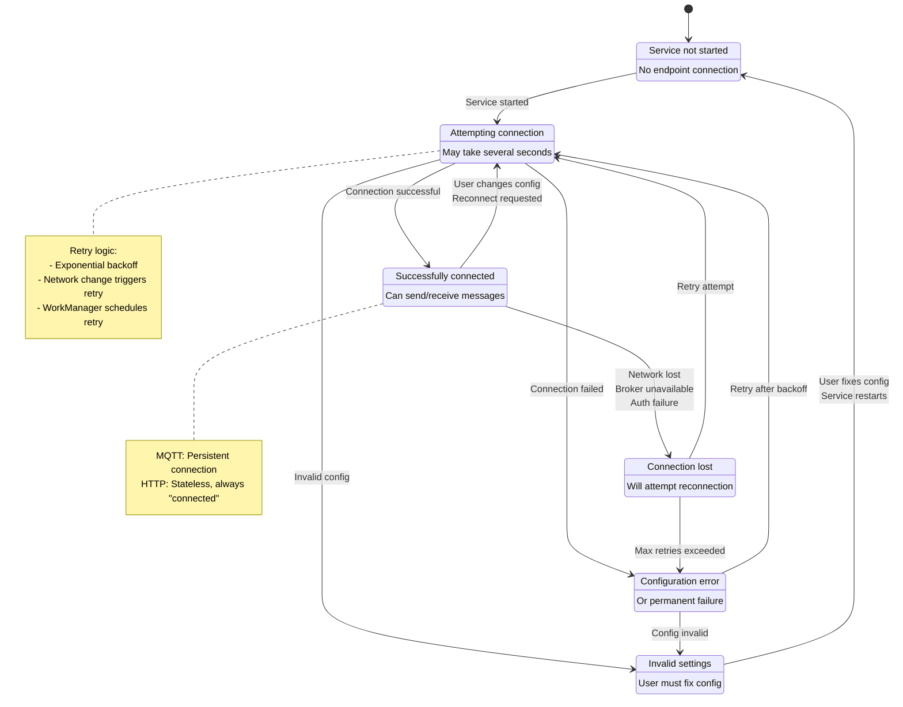

# OwnTracks Android - Data Flow Design Document

## Overview

OwnTracks receives a range of data items from a number of different sources, so this attempts to visualize how the different components interact and the data flows between them.

It's also there to help guide a simplification of the design.

## Architecture Overview

```mermaid
graph TB
    subgraph "UI Layer"
        MapActivity
        ContactsActivity
        WaypointsActivity
        StatusActivity
        WaypointActivity
        WelcomeActivity
        EditorActivity
        LoadActivity
        MapViewModel
        ContactsViewModel
        WaypointsViewModel
        StatusViewModel
        WaypointViewModel
        WelcomeViewModel
        EditorViewModel
        LoadViewModel
    end

    subgraph "Service Layer"
        BackgroundService
        MessageProcessor
        LocationProcessor
        Parser
        Preferences
        EncryptionProvider
    end

    subgraph "Repository Layer"
        ContactsRepo
        WaypointsRepo
        LocationRepo
        EndpointStateRepo
    end

    subgraph "Network Layer"
        MQTTMessageProcessorEndpoint
        HttpMessageProcessorEndpoint
    end

    subgraph "Location Layer"
        LocationProviderClient
        GeofencingClient
    end

    subgraph "Data Layer"
        prefs[(SharedPreferences)]
        room[(Room Waypoints)]
        sqlite[(SQLite MQTT)]
        files[(FileSystem Queue)]
    end

    MapActivity --> MapViewModel
    ContactsActivity --> ContactsViewModel
    WaypointsActivity --> WaypointsViewModel
    StatusActivity --> StatusViewModel
    WaypointActivity --> WaypointViewModel
    WelcomeActivity --> WelcomeViewModel
    EditorActivity --> EditorViewModel
    LoadActivity --> LoadViewModel

    MapViewModel --> LocationRepo
    MapViewModel --> ContactsRepo
    MapViewModel --> EndpointStateRepo
    MapViewModel --> WaypointsRepo
    MapViewModel --> Preferences
    MapViewModel --> LocationProcessor
    MapViewModel --> MessageProcessor

    ContactsViewModel --> ContactsRepo

    WaypointsViewModel --> WaypointsRepo
    WaypointsViewModel --> LocationProcessor

    StatusViewModel --> EndpointStateRepo
    StatusViewModel --> LocationRepo

    WaypointViewModel --> WaypointsRepo
    WaypointViewModel --> LocationRepo

    WelcomeViewModel --> Preferences

    EditorViewModel --> Preferences
    EditorViewModel --> Parser
    EditorViewModel --> WaypointsRepo

    LoadViewModel --> WaypointsRepo
    LoadViewModel --> Preferences
    LoadViewModel --> Parser

    BackgroundService --> LocationProviderClient
    BackgroundService --> GeofencingClient
    BackgroundService --> MessageProcessor
    BackgroundService --> LocationProcessor
    BackgroundService --> Preferences
    BackgroundService --> ContactsRepo
    BackgroundService --> LocationRepo
    BackgroundService --> WaypointsRepo

    LocationProcessor --> MessageProcessor
    LocationProcessor --> WaypointsRepo
    LocationProcessor --> LocationRepo
    LocationProcessor --> Preferences

    MessageProcessor --> MQTTMessageProcessorEndpoint
    MessageProcessor --> HttpMessageProcessorEndpoint
    MessageProcessor --> ContactsRepo
    MessageProcessor --> WaypointsRepo
    MessageProcessor --> EndpointStateRepo
    MessageProcessor --> Preferences
    MessageProcessor --> Parser

    Parser --> EncryptionProvider

    MQTTMessageProcessorEndpoint --> sqlite
    MessageProcessor --> files
    WaypointsRepo --> room
    Preferences --> prefs
```

## Outbound Data Flow - Publishing Location

### Complete Flow: Location Acquisition to Network Transmission

## Inbound Data Flow - Receiving Messages

### Sequence 3: Network to Contact/Waypoint Update

## Geofencing Data Flow

### Sequence 4: Waypoint Creation to Geofence Registration

### Sequence 5: Geofence Transition Event

## Remote Command Execution

### Sequence 6: Remote Command Processing

## Data Persistence

### Diagram: Storage Architecture

## Message Types

### Diagram: Message Type Hierarchy

```mermaid
classDiagram
    class MessageBase {
        <<abstract>>
        +String topic
        +Int qos
        +Boolean retained
        +Int numberOfRetries
        +isValidMessage() Boolean
        +toJson(parser) String
        +annotateFromPreferences(preferences)
    }

    class MessageLocation {
        +Double latitude
        +Double longitude
        +Int accuracy
        +Int altitude
        +Int velocity
        +Int bearing
        +Long timestamp
        +Int battery
        +BatteryStatus batteryStatus
        +ReportType trigger
        +List~String~ inregions
        +String trackerId
        +String ssid
        +String bssid
    }

    class MessageTransition {
        +String event
        +String desc
        +Long wtst
        +Double latitude
        +Double longitude
        +Int accuracy
        +Long timestamp
    }

    class MessageWaypoint {
        +String desc
        +Double latitude
        +Double longitude
        +Int radius
        +Long timestamp
    }

    class MessageWaypoints {
        +List~MessageWaypoint~ waypoints
    }

    class MessageCard {
        +String name
        +String face
    }

    class MessageCmd {
        +CommandAction action
        +MessageWaypoints waypoints
        +MessageConfiguration configuration
    }

    class MessageConfiguration {
        +ConnectionMode mode
        +String host
        +[100+ preference fields]
    }

    class MessageEncrypted {
        +String data
    }

    class MessageClear {
    }

    MessageBase <|-- MessageLocation
    MessageBase <|-- MessageTransition
    MessageBase <|-- MessageWaypoint
    MessageBase <|-- MessageWaypoints
    MessageBase <|-- MessageCard
    MessageBase <|-- MessageCmd
    MessageBase <|-- MessageConfiguration
    MessageBase <|-- MessageEncrypted
    MessageBase <|-- MessageClear

    note for MessageLocation "Outbound: Published location updates\nInbound: Received from contacts\nTrigger types: USER, PING, CIRCULAR, RESPONSE"
    note for MessageTransition "Outbound: Own geofence transitions\nInbound: Contact geofence transitions\nEvents: enter, leave, dwell"
    note for MessageCmd "Inbound only: Remote commands\nActions: reportLocation, waypoints,\nsetWaypoints, setConfiguration,\nreconnect, restart"
    note for MessageEncrypted "Wrapper for encrypted messages\nContains encrypted JSON in data field\nUses libsodium secret box"
```

## Component Dependencies

### Diagram: Dependency Graph

## Connection State Machine

